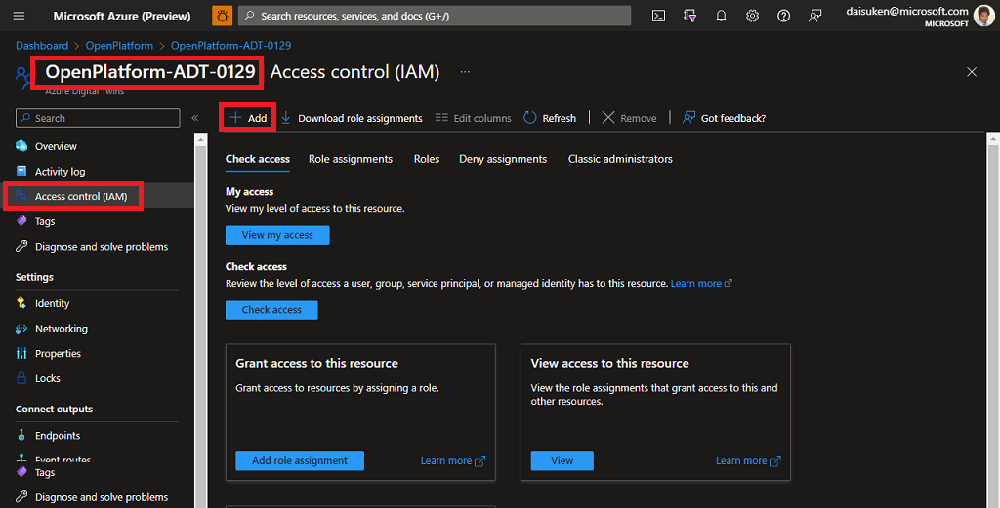
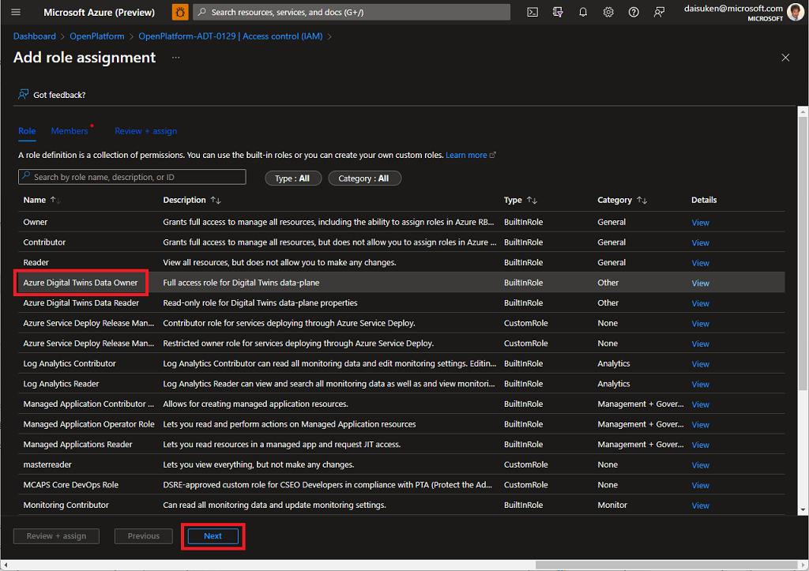
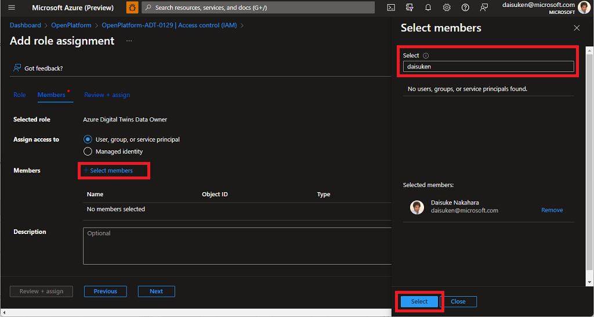
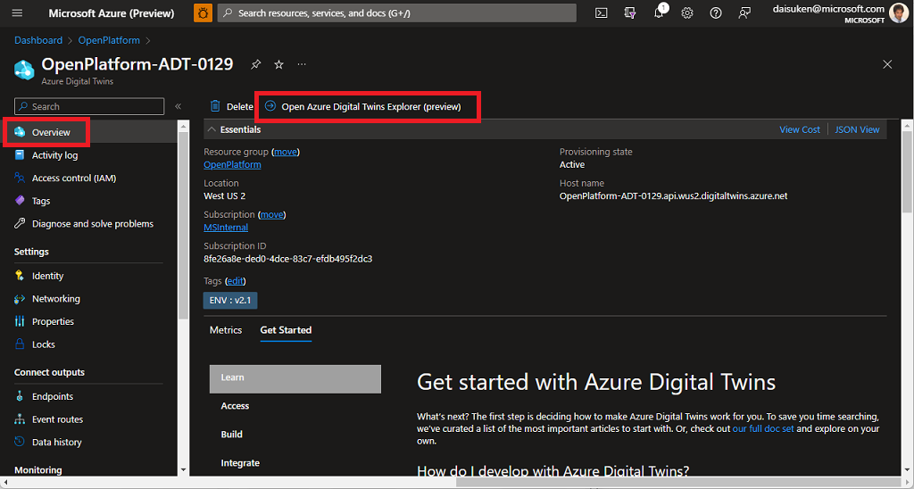
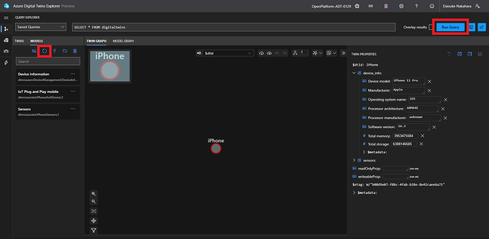

# Azure Digital Twins (ADT) integration

If you chose to include ADT in your Open Platform deployment, the template add Azure Digital Twins instance to your deployment.  With Azure Digital Twins, Open Platform performs followings:

1. Creates Digital Twin models and twins when IoT Plug and Play devices are connected
1. Updates properties from IoT Plug and Play devices to Digital Twins

## Models and Twins

When IoT Plug and Play devices are connected, Open Platform creates models for your device and creates a digital twin in ADT.  
For example, when IoT PnP Smartphone device is connected 

## Azure Digital Twins Explorer

ADT Explorer is a web based application to visualize digital twins.  In order to use ADT Explorer, you must give yourself permission.

### 1. Assigning Role

1. Browse to [Azure Portal](https://portal.azure.com)
1. Navigate to the resource group of your Open Platform deployment
1. Open Azure Digital Twins instance
1. Click **Access control (IAM)**
1. Click **+ Add**
1. Select **Add role assignment**

    

1. Select **Azure Digital Twins Data Owner**
1. Click **Next**

    

1. Click **+Select members**
1. Search and find your Azure account to add

    

1. Review and assign permission.

With this, you may access to your ADT using ADT Explorer

### 2. Start ADT Explorer

1. Navigate to ADT instance overview page
1. Click **Open Azure Digital Twins Explorer**

    

1. If IoT Plug and Play device(s) is connected, such as IoT PnP smartphone app, you should see twin(s).

    e.g. IoT PnP smartphone is connected with Device ID `iPhone`.  A twin `iPhone` with properties is displayed.

    

if you do not have IoT Plug and Play device, install [IoT PnP smartphone app](ConnectingPhone.md) and provision your smartphoe so you can visualize.

## Next Step

- Developers : Learn more technical details of the Open Platform Open Platform Developer Guide : [Architecture Overview](../Developer-Guide/Architecture-Overview.md)

[Project 15 from Microsoft - Open Platform](../README.md)
