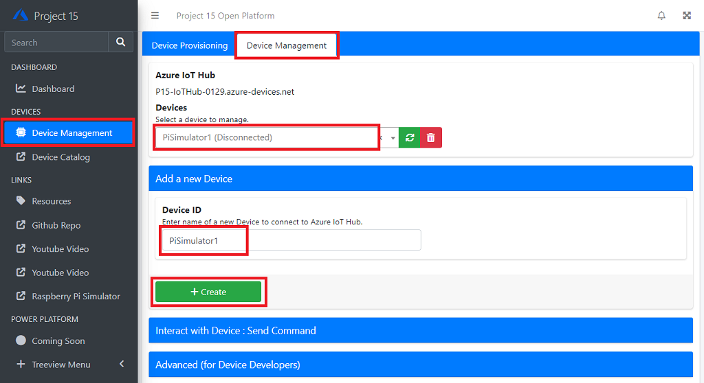
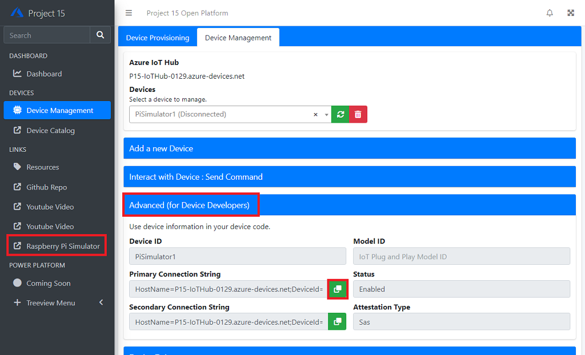
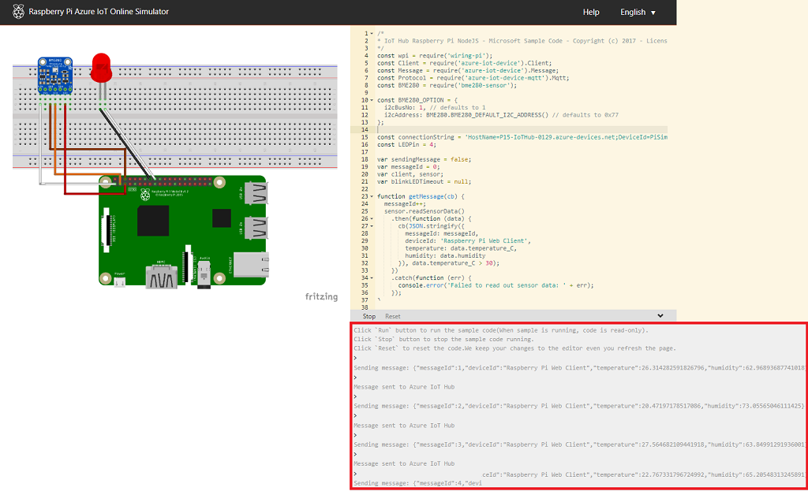
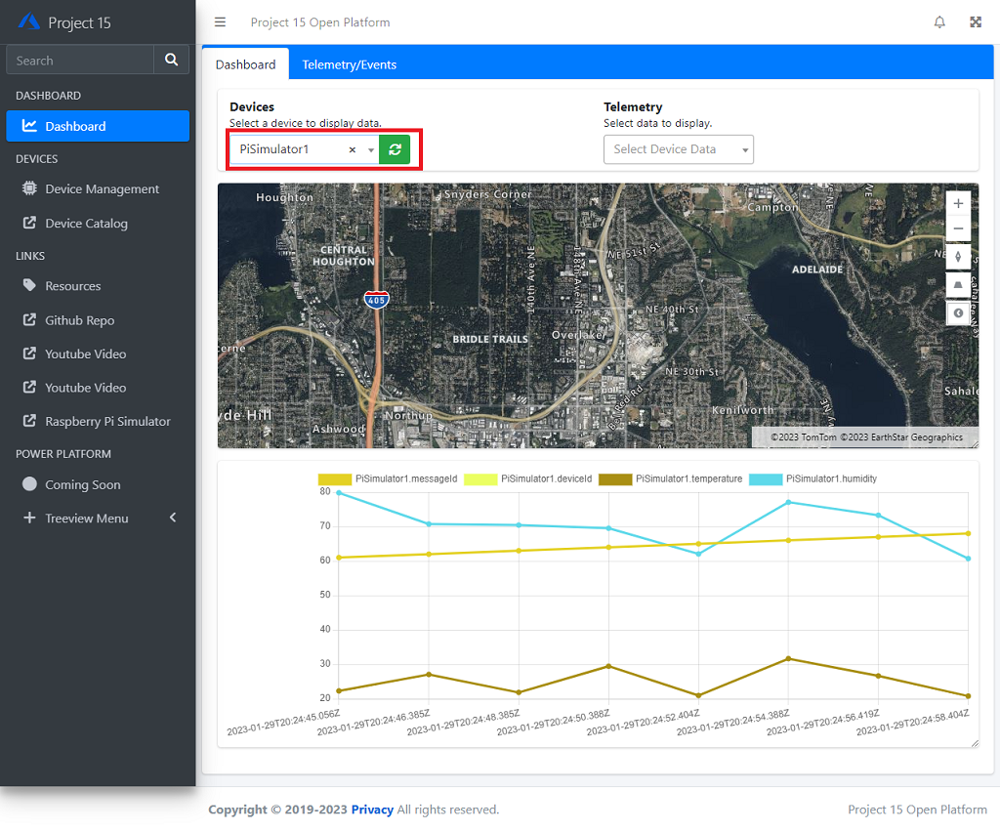

# Connect IoT devices to the Open Platform

This document walks through :

1. Provisioning a device to Open Platform
1. Visualizing data from devices

## Requirements

- A PC with web browser
- Optional : A device to connect to Open Platform solution  
    - If you do not have any of following devices, you may use Raspberry Pi Web Simulator
    - Raspberry Pi  
    - Seeed WIO Terminal
    - A PC with Linux

## Provisioning a device to Open Platform

In order to consume (e.g. visualize) data from a device, the device must be provisioned.  Provisioning device means :

1. Creating device identity in IoT Hub
1. Prepare a device
1. Authenticating the device
1. Establishing a connection

### 1 : Creating a device identity in IoT Hub

A device must be known to the solution.  Creating a device identity means registering a device entity in IoT Hub.
In this instruction, we will use Raspberry Pi Azure IoT Online Simulator.

1. Browse to Open Platform Web Dashboard with your browser
1. Click **Device Management** in the Navigation Menu
1. Click **Device Management** tab
1. Click **Add a device**
1. Give a name for the new device
    e.g. PiSimulator1
1. Click **+Create**

Once a new device is successfuly created, it should be added to the dropdown device list

### 2. Preparing a device

Each device firmware/device app has their own way of programming authentication information.  For this demo, we will use [Raspberry Pi Azure IoT Online Simulator](https://azure-samples.github.io/raspberry-pi-web-simulator/).

1. Browse to **Raspberry Pi Azure IoT Online Simulator** with your browser 

    Click **Raspberry Pi Simulator** in the Navigation Menu

1. Select the new device you created above, if not selected
1. Click **Advanced (for Device Developers)**

    You should see fields are filled.

1. Click green button next to **Primary Connection String**

    This will copy the connection string in clipboard.

### 3. Connecting a device

1. Switch to **Raspberry Pi Azure IoT Online Simulator**

    Replace `[Your IoT hub device connection string]` with the connection string

    > [!IMPORTANT]  
    > Ensure the connection string is inside single quotes `` ` `` `` ` ``
    >
    > Correct  
    > const connectionString = `` ` ``HostName=P15-IoTHub-jq.......`` ` ``;
    >
    > Incorrect  
    > const connectionString = HostName=P15-IoTHub-jqs.......;

    Example :

    

1. Click `Run` button to connect and start sending simulated telemetry to Open Platform.

    In the bottom right pane, you should see log saying the simulator is connected and sending telemetry.

    

1. Switch to Open Platform portal  

    Confirm telemetry and events are pushed to the portal.  

    > [!NOTE]
    > Make sure you click **Stop** in Raspberry Pi Simulator or close browser when you are finished.

    

## Next Step

- Developers : Learn more technical details of the Open Platform Open Platform Developer Guide : [Architecture Overview](../Developer-Guide/Architecture-Overview.md)

[Project 15 from Microsoft - Open Platform](../README.md)
