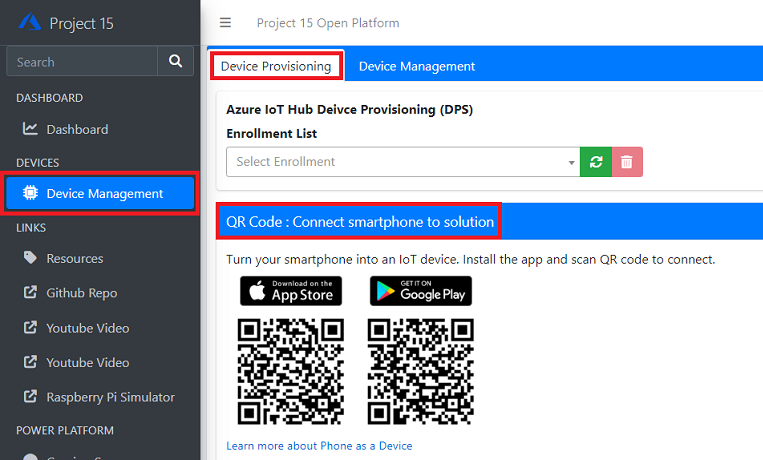
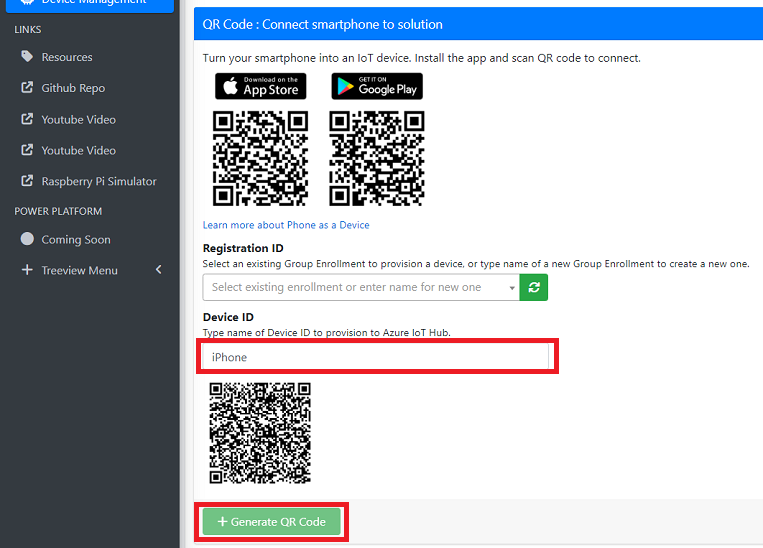
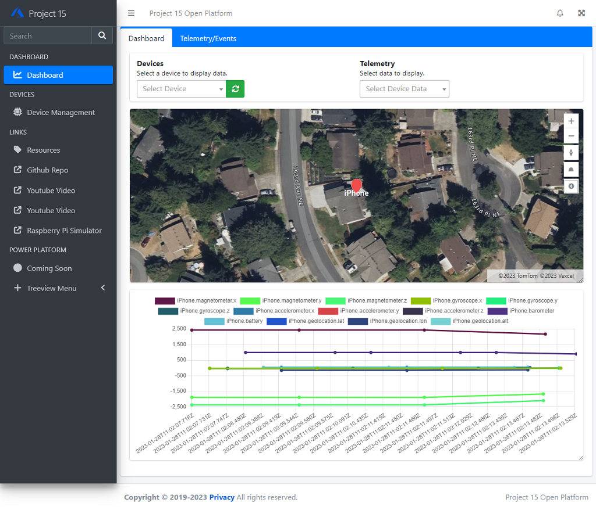

# Connect IoT devices to the Open Platform

This document walks through :

1. Install IoT PnP Phone App to your smartphone
1. Generate QR Code for provisioning
1. Connecting phone to Open Platform

## Requirements

- A PC with web browser
- Smartphone (iPhone or Android)

## Provision Smartphone to Open Platform

### 1 : Installing IoT PnP app to your smartphone

1. Browse to Open Platform web site
1. Select **Device Management** in the left Navigation Bar
1. Select **Device Provisioning** tab
1. Select **QR Code : Connect smartphone to solution** tab
1. Use smartphone to scan QR code (either Apple Store or Google Play)
1. Install IoT PnP app

    

### 2. Generating QR Code for provisioning

1. Give a Device ID for your smartphone, e.g. iPhone
1. Click **Generate QR Code**

    

### 3. Connecting phone to Open Platform

1. Open **IoT PnP** app on your smartphone
1. Scan the generated QR code in step 2

    It may take 1 min or so to provision smartphone

## View data from Smartphone

Select **Dashboard** in the left Navigation Bar, chart and map should be updated as data is develiered to the cloud backend.

- Map will add a Pin based on GPS data
- Chart displays sensor data
- You can filter based on **Device ID** and/or **Device Data**
- Raw data is available in **Telemetry/Events** tab

## Next Step

- [Connect a device](ConnectingDevice.md) directly to IoT Hub
- Developers : Learn more technical details of the Open Platform Open Platform Developer Guide : [Architecture Overview](../Developer-Guide/Architecture-Overview.md)

[Project 15 from Microsoft - Open Platform](../README.md)
