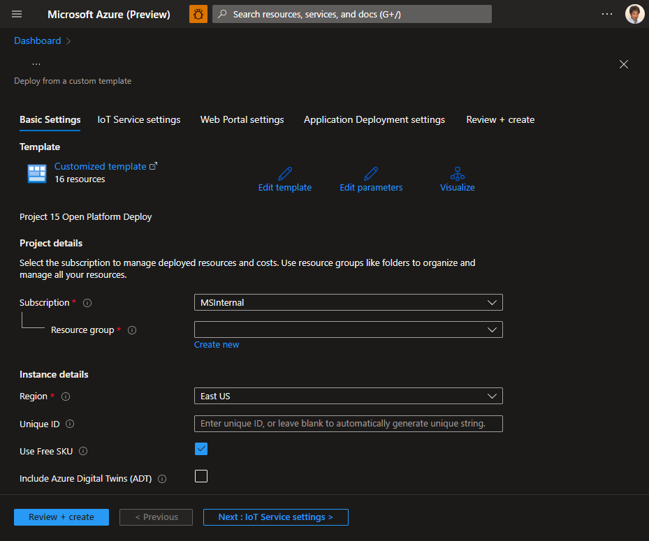
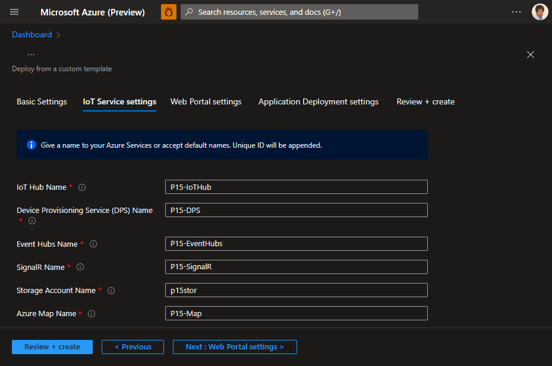
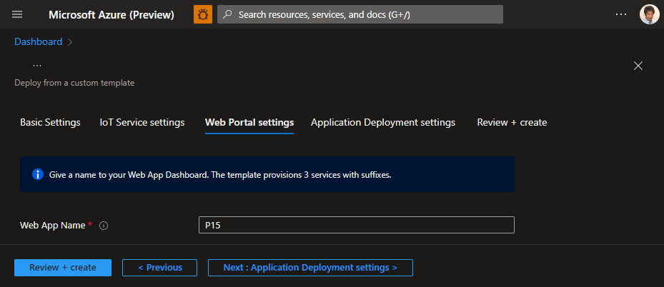
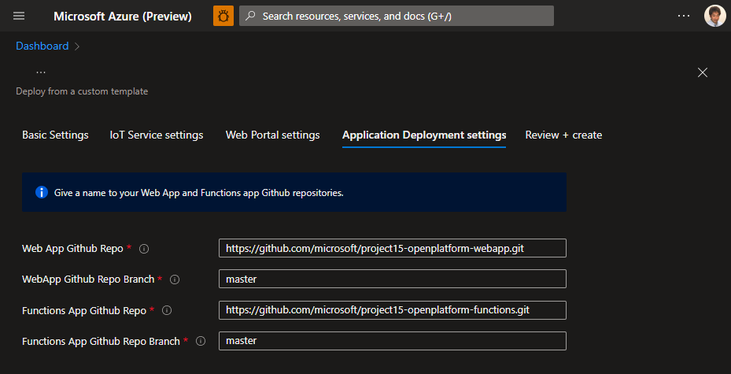
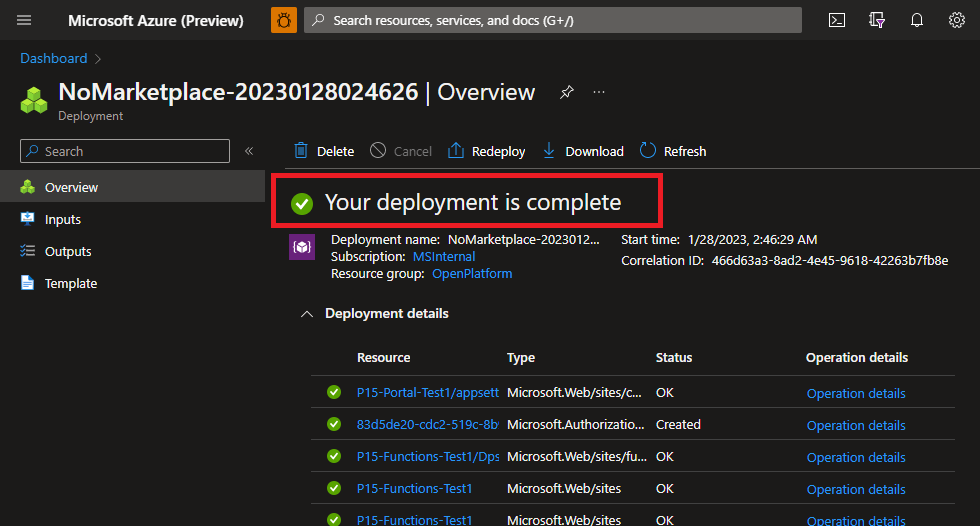
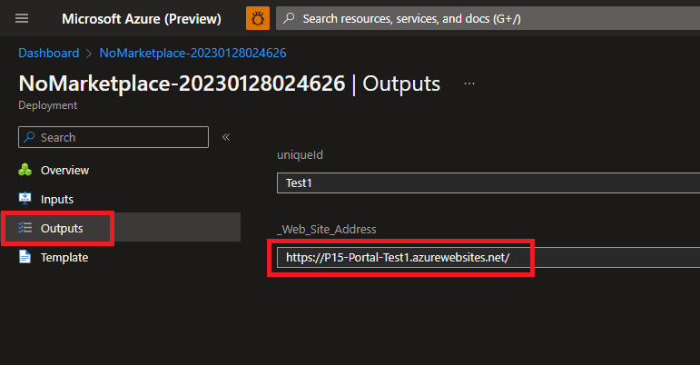

# Deploying Project 15 from Microsoft Open Platform in 3 steps

This document walks through deployment of Project 15 from Microsoft Open Platform in 3 steps.

1. Click to open Azure Resource Manager (ARM) Template
1. Personalize and configure deployment
1. Run Post Deployment Script

## Requirements

- Azure Subscription  
    If you do not have Azure Subscription, please create an account for free (12 months)  
    <https://azure.microsoft.com/free/>  
    You must be an administrator or an owner of the subscription  
- A PC with Web Browser

## 1. Open ARM Template Deployment

Click **Deploy to Azure** button below  

> [!TIP]  
> Right click the button below and select **Open link in new tab** or **Open lin in new window**

> [!NOTE]  
> This deployment will consume about 100 USD per month.  If you would like to deploy for your development, turn on `Development Environment` option to deploy with Free SKUs.  With Free SKUs, quotas and limitations apply.

## 2 : Personalize and configure Open Platform Deployment

1. Select Subscription (if you have more than one)

    If you do not have Azure Subscription, please create an account for free for 12 months

    https://azure.microsoft.com/free/

1. Create a new resource Group

    A resource group is a container that holds related resources for an Azure solution. Similar to folder and files.

    Open the dialog box by clicking Create new and give a unique name such as MyOpenPlatformSolution

1. Select Azure Region nearest to you
1. Select Unique ID  
    
    Some Azure services and names such as web site URL require globally unique ID. The default is a random string based on the resource group. You may enter your own unique ID string.

    - Minimum 3 characters
    - Maximum 10 characters
    - Alphanumeric characters only (no special characters)

1. If you would like to minimize cost, select **Use Free SKU**

    With Free SKUs, quotas and limitations apply.

1. If you would like to add Azure Digital Twins, select **Include Azure Digital Twins** 

## 3 : Name Azure resources (Optional)

You may give unique names to your Azure resources.  The template will add **-[UniqueID]** to names.

## 4 : Name your Web Dashboard (Optional)

You may give unique names to your Web Dashboard application.  The template will add **-Portal-[UniqueID]**.

## 5 : Change application source (Optional)

If you have your own repository or branches, you may specify those repositories.

## 6 : Wait for deployment

Deployment typically completes in less than 10 minutes.  Wait until deployment completes successfully.

## 6 : Browse to Dashboard Web

You can find URL of Dashboard in **Output** pane.  Copy the URL and open with your favorite Web Browser.

## Next Step

- [Brief introduction](OpenPlatformPortal.md) of Open Platform Portal
- [Connect a device](ConnectingDevice.md) to the Open Platform web application
- Developers : Learn more technical details of the Open Platform Open Platform Developer Guide : [Architecture Overview](../Developer-Guide/Architecture-Overview.md)

[Project 15 from Microsoft - Open Platform](../README.md)
