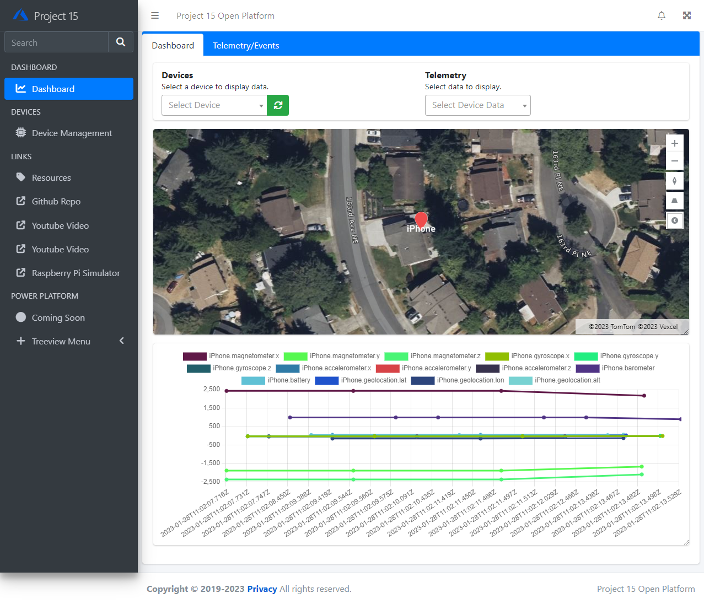
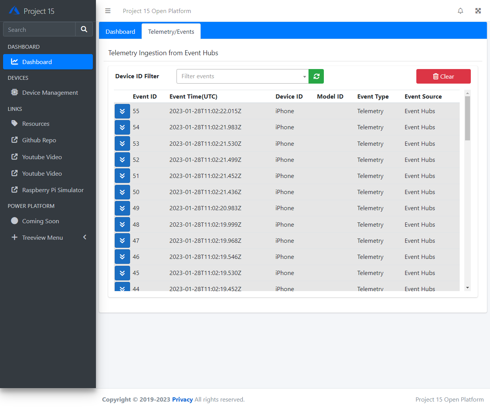
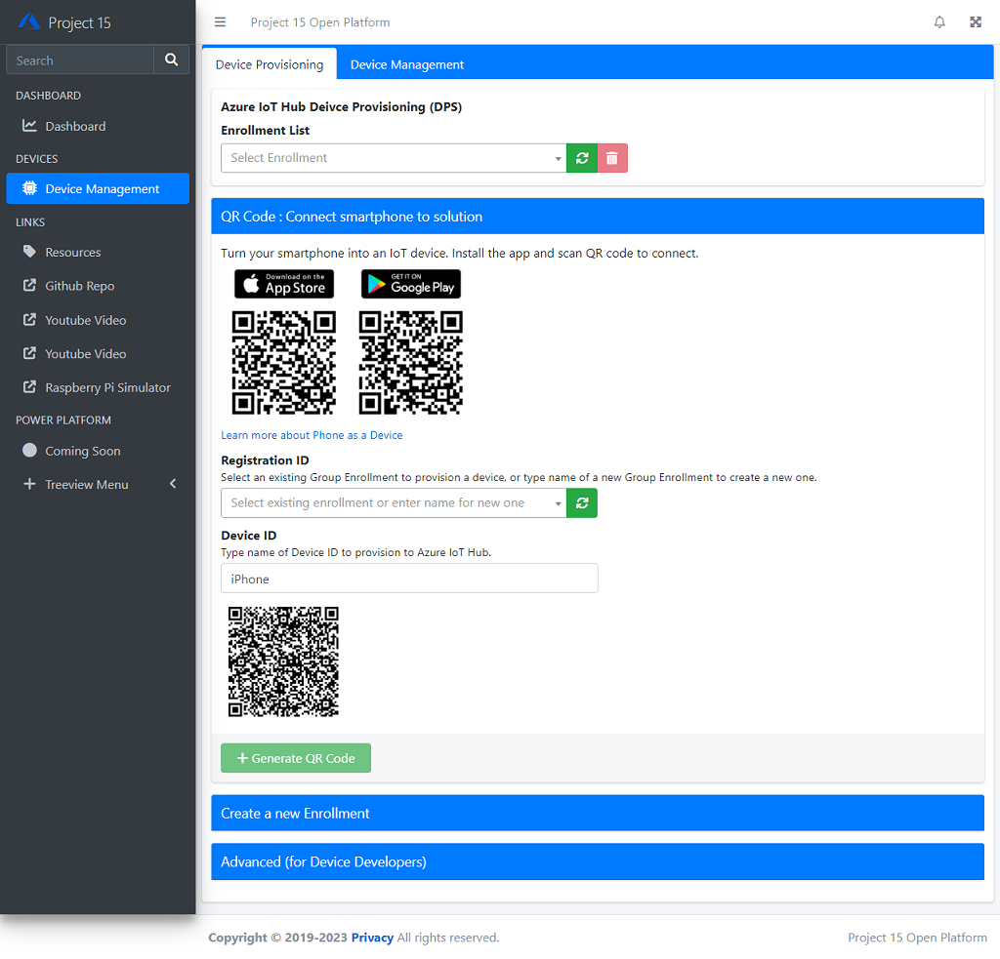
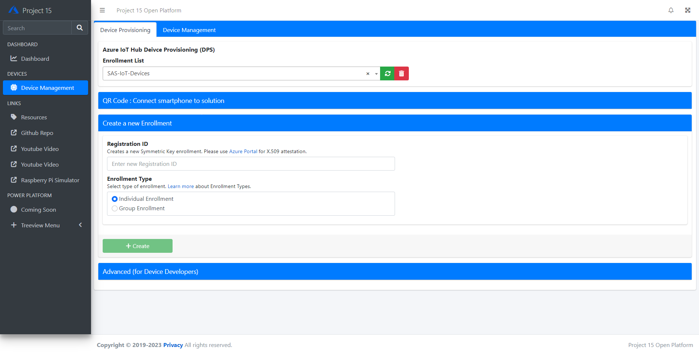
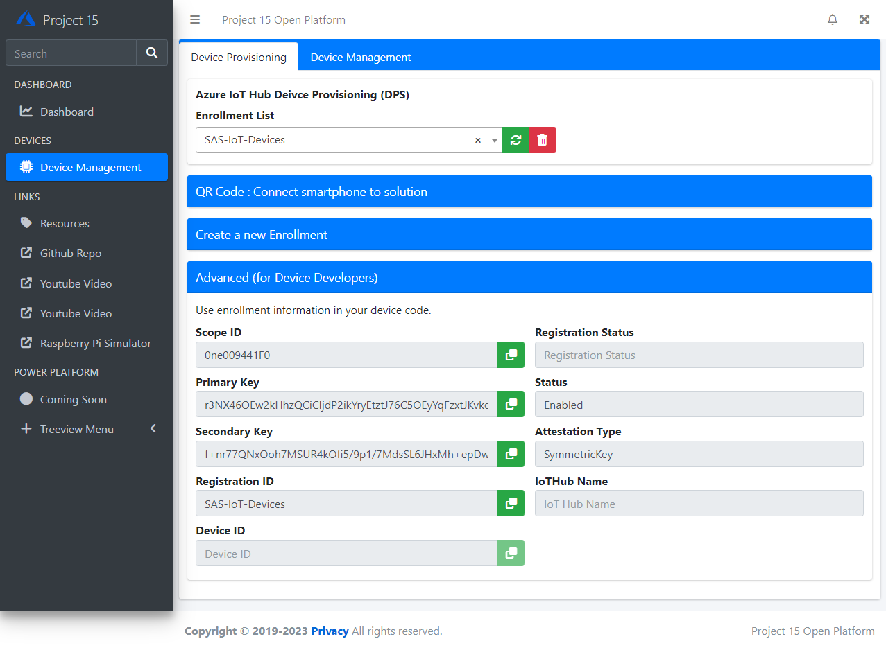
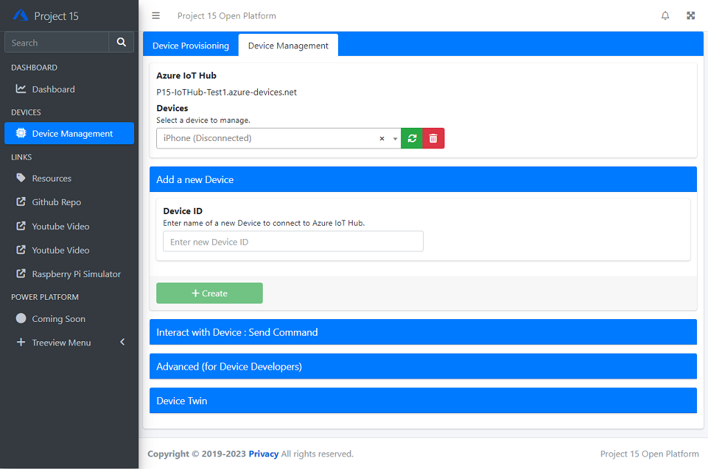
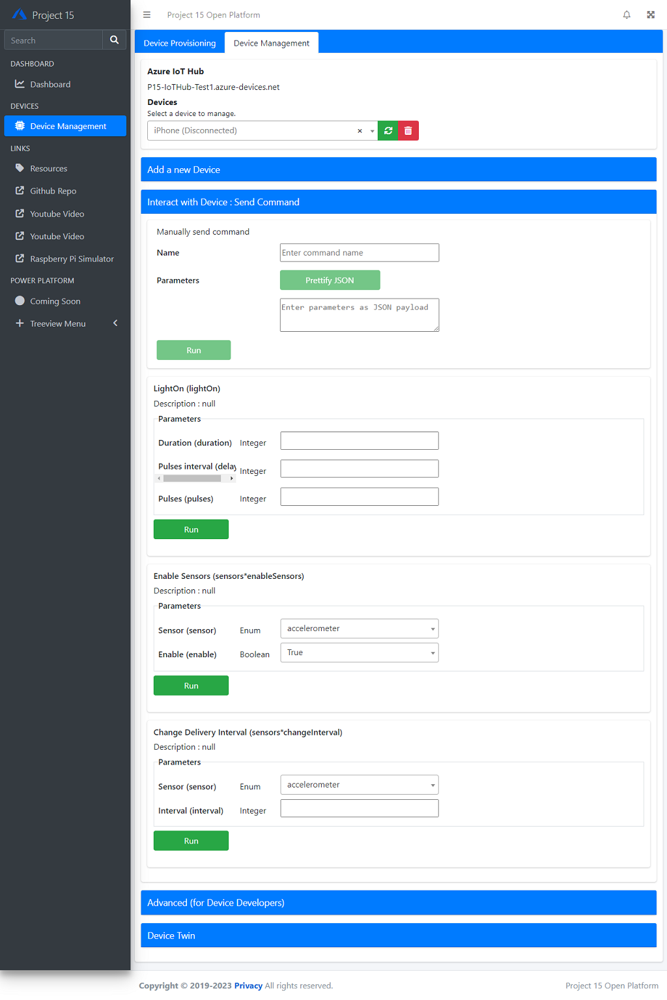
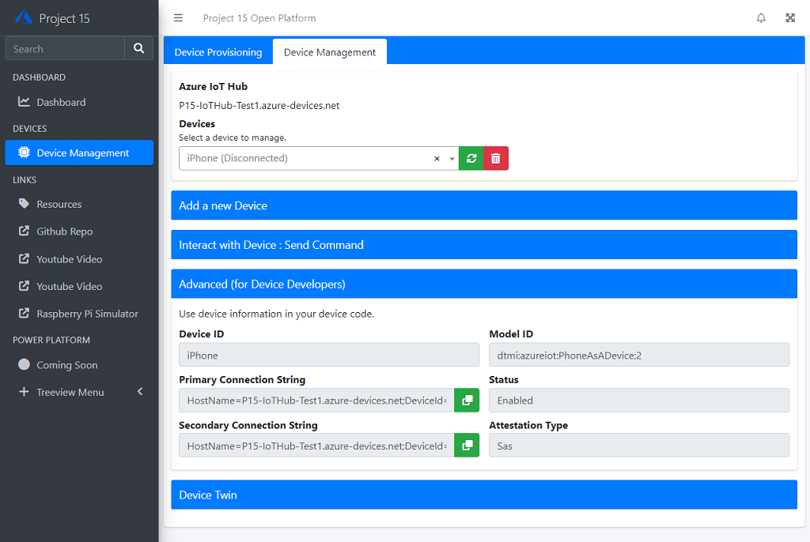

# Open Platform portal

The Web UI is structured with 3 key components.

1. Navigation Bar (Left menu)
1. Dashboard view to visualize data
1. Device Management View

## Navigation Bar

- Example of Menu.  You may add your own item/link to [_Layout.cshtml](https://github.com/microsoft/project15-openplatform-webapp/blob/master/OpenPlatformV2/Views/Shared/_Layout.cshtml) 

## Dashboard

Dashbaord view provides followings :

- Azure Map
    - If you device supports location data (e.g. GPS) with one of DTDL location information, the UI will add Pin to the map.  
    - You may resize the map by dragging right bottom corner of the map.

- Telemetry Chart
    All telemetry data is displayed in line graph.  The chart is built based on JChart.  You may customize your view/chart in [Index.cshtml](https://github.com/microsoft/project15-openplatform-webapp/blob/master/OpenPlatformV2/Views/Home/Index.cshtml).

    - If the device is IoT Plug and Play, you may select data to display in the dropdown box.
    - You may resize the map by dragging right bottom corner of the chart.

    

- Raw Data
    All device data as well as device events are displayed in table format in **Telemetry/Event** tab.
    To see detailed data, click on button on each line (far left).

    

## Device Management

Device Management UI provides :

- Provision devices using Device Provisioning Service (DPS)
- Manage DPS enrollment
- Manage IoT Hub

### Device Provisioning tab

Device Provisioning tab provides UI to manage DPS enrollments.

- QR Code to connect your smartphone to Open Platform

    You can use your smartphone to connect to Open Platform.  
    
    1. Install IoT Plug and Play smartphone app using QR code
    1. Specify **Device ID** to generate QR code
    1. Use IoT Plug and Play smartphone app to provision to Open Platform

    

- Create a new Enrollment

    If you need to create a new enrollment for your device, you can create symmetric key based enrollment.  

    

- Advanced

    If you are a device firmware developer, this tab provides information you need to embed to your firmware code.

    

### Device Management tab

Device Management tab provides UI to manage devices on IoT Hub.

- Add a new Device

    Manually create a new device.

    

- Interact with Device

    Device commands are automatically populated for IoT Plug and Play devices.  For legacy devices, you may enter commands manually.

    

- Advanced

    If you are a device firmware developer, this tab provides information you need to embed to your firmware code.

    

- Device Twin

    You can display Device's twin in this tab.  Select a device from the list in the top to display Device Twin.

    

## Next Step

- [Connect your phone](ConnectingPhone.md) to connect your phone to Open Platform
- [Connect a device](ConnectingDevice.md) directly to IoT Hub
- Developers : Learn more technical details of the Open Platform Open Platform Developer Guide : [Architecture Overview](../Developer-Guide/Architecture-Overview.md)

[Project 15 from Microsoft - Open Platform](../README.md)